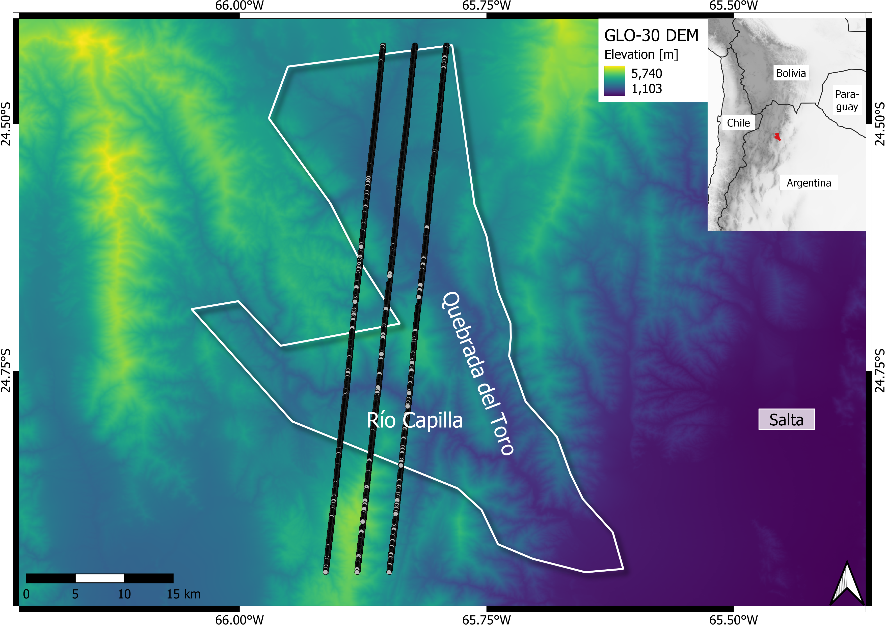
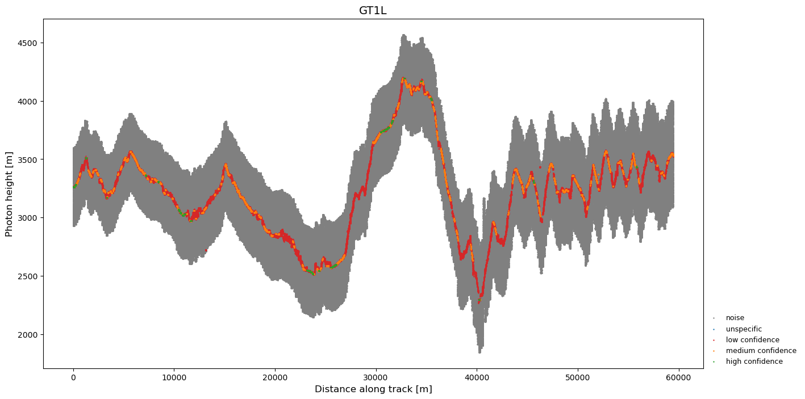
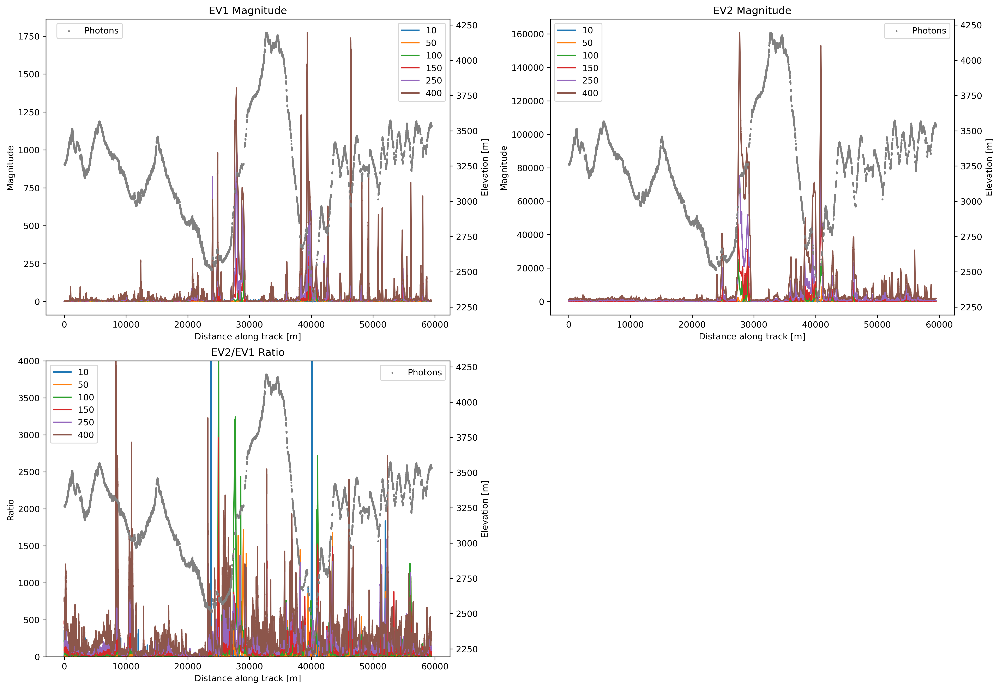
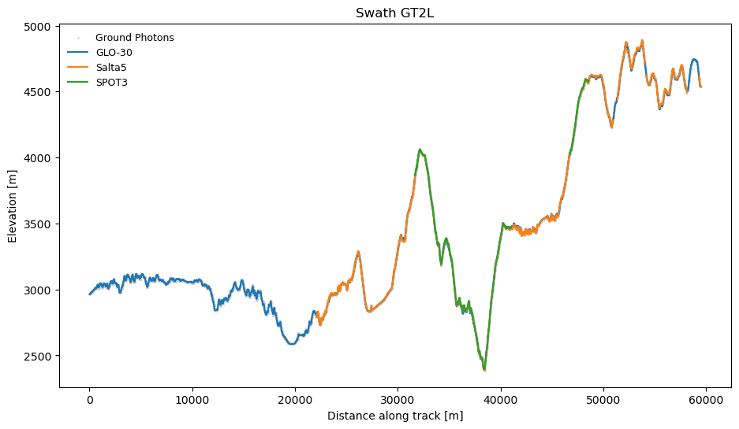
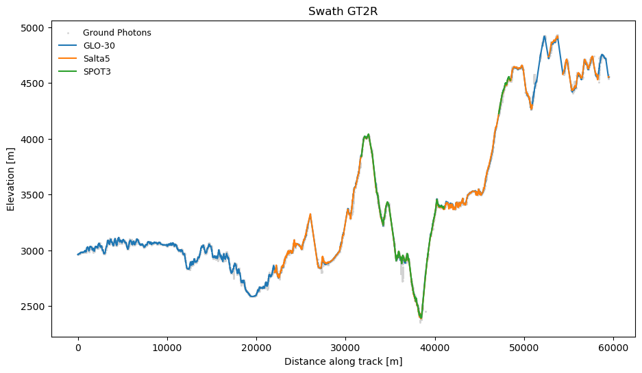
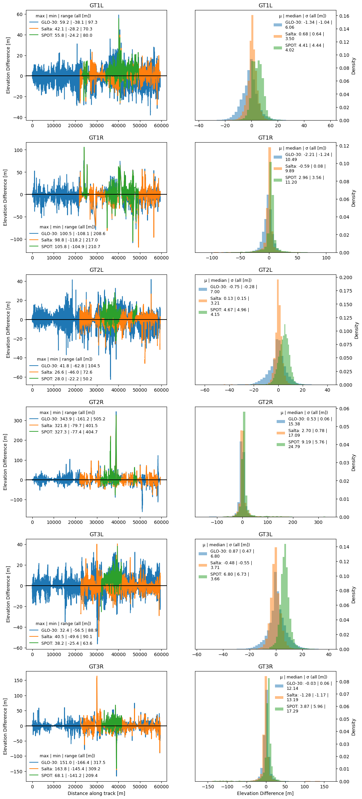
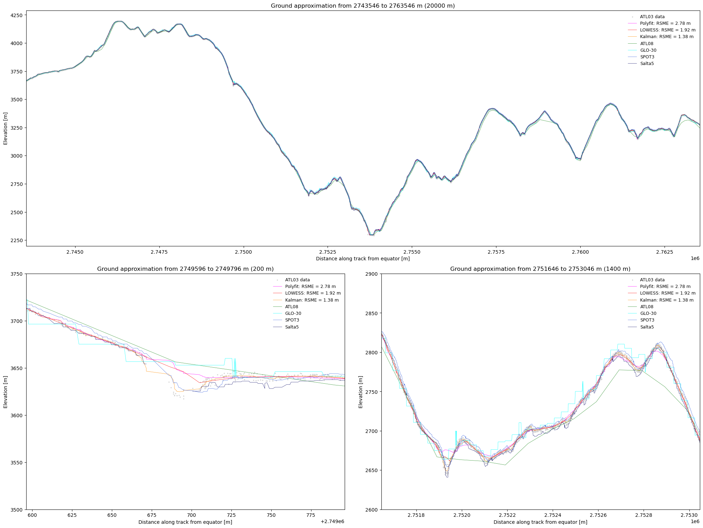
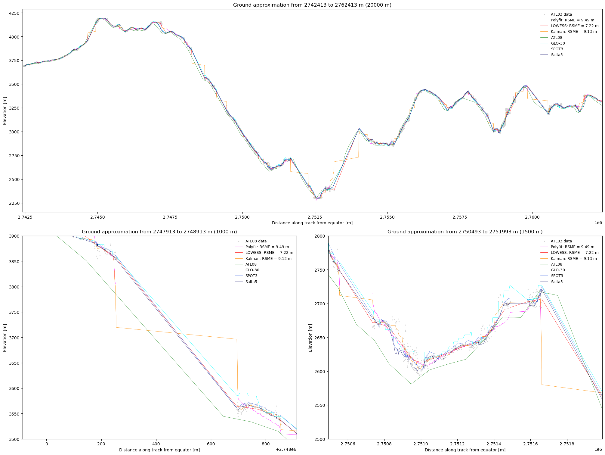

# The ICESat-2 mission

The retrieval of high resolution ground profiles is of great importance for the analysis of geomorphological processes such as flow processes ([A. Mueting, B. Bookhagen, and M. R. Strecker, 2021](#sources)) and serves as the basis for research on river flow gradient analysis ([Scherer et al., 2022](#sources)) or aboveground biomass estimation ([Atmani, Bodo Bookhagen, and Smith, 2022](#sources)). The digital elevation models (DEMs) used for such analyses can be derived through different methods, such as stereophotogrammetry with passively acquired data or active methods like radar (radio detection and ranging) and lidar (light detection and ranging). Lidar derived products in particular can reach high spatial resolutions ([Neuenschwander and Pitts, 2019](#sources)) and for DEM generation are usually acquired from the air or from space. 

One such spaceborne mission that operates with lidar is ICESat-2 with an identically-named satellite that has the "Advanced Topographic Laser Altimeter System" (ATLAS) instrument onboard. ICESat-2's objective is to measure and help map the elevation of clouds and ice and land surfaces globally and monitor vegetation height. 
The laser of ICESat-2 is split into six beams in three pairs, which are approximately 3.3 kilometers apart across-track, the beams of each pair are 90 meters apart. Each pair has a stronger left beam and a weaker right beam with each beam having a footprint of 17 m diameter with a 0.7 m sampling interval ([Neuenschwander and Pitts, 2019](#sources)). 
ICESat-2's data  products comes in different processing levels with varying features. The level 2 data product “Global Geolocated Photon Data” (ATL03) features all recorded photons, containing information on latitude, longitude, height, surface type and signal confidence. An ICESat-2 product that has global terrain height available is the level 3b “Global Geolocated Photon Data” (ATL08) but it has a fixed downsampled spatial resolution of 100 meters ([National Snow and Ice Data Center, 2023](#sources)). For detailed analyses on landscapes with large changes in relief over small areas, this resolution is too coarse. 

Given the necessity for high resolution ground profiles and the promising 70 centimeter sampling interval of ICESat-2 data in the ATL03 product, this raises the following research question:

*With what geometry based approaches is it possible to extract ground profiles from ICESat-2 ATL03 data and with what accuracy?*

**This internship was supervised by Prof. Dr. Bodo Bookhagen.**

# Study Area

The study area of this internship consists of the Quebrada del Toro and the Río Capilla catchment west of it, both located in the Toro basin in the Eastern Cordillera of northwestern Argentina. Figure 1 shows the topography and location of the study area.  The Toro basin is located between the Puna-Altiplano Plateau in the west and the foreland in the east, near the city of Salta ([A. Mueting, B. Bookhagen, and M. R. Strecker, 2021; Hilley and Manfred R. Strecker, 2005](#sources)). 
The Quebrada del Toro is characterized by high relief with deep incision ([A. Mueting, B. Bookhagen, and M. R. Strecker, 2021](#sources)). In the northernmost part of the study area, elevation is 3,500 m a.s.l. in the mountains and 2,700 m in the valleys. The central part of the study site shows the highest elevation with up to 4,180 m a.s.l. and the narrow, steep valley of Río Toro that incises the landscape ([A. Mueting, B. Bookhagen, and M. R. Strecker, 2021](#sources)). The basin outlet in the forelands in the southern part of the study area shows elevations of 1,450 m a.s.l.

<center>
<figure>
<figcaption>Figure 1: Map of the Quebrada del Toro and Río Capilla catchment. The area of interest is outlined in white. The background GLO-30 DEM shows the geoid based elevation in the area. The six ICESat-2 beams are displayed by signal photons. The location of the study area is displayed red in the inset map with the ETOPO5 DEM in the background.</figcaption>
</figure>
</center>

# Datasets


ATL03 data can be accessed and downloaded as hdf5 files through the [Data Access Tool](https://nsidc.org/data/data-access-tool/ATL03/versions/5)
of the NSIDC (National Snow and Ice Data Center). For this internship, a dataset from 29/05/2022 that goes through the center of the study area was chosen (see Figure 1). The reference ground track of the dataset is 1032, cycle number 15, segment number 8.

Each of the six ICESat-2 beams was extracted and then filtered for signal photons by the confidence flags that ATL03 data provides for every photon: flags 2 to 4 indicate low, medium and high confidence, respectively; photons that were labelled noise or unspecified were not used for analysis. 
The distribution of photon confidence along the track can be seen in Figure 2.  
<center>
<figure>
<figcaption>Figure 2: Distribution of photon confidence flags for beam GT1L, plotted along the distance of the track against the photon height. Photons of low, medium and high confidence are labeled signal photons to be used for the analysis. </figcaption>
</figure>
</center>


Validation data was used in the form of DEMs. Three DEMs were used with the addition of a global geoid dataset to correct for different height coordinate reference systems. 

The first DEM used was the Quebrada del Toro 3m DEM, which was created in [A. Mueting, B. Bookhagen, and M. R. Strecker, 2021](#sources) from tri-stereo SPOT-7 satellite data. The DEM file was derived from [Zenodo](https://zenodo.org/record/5653779) and has a accuracy of 0.051 ± 1.915 m, but covers a smaller extent than the study area. Its vertical coordinate system is WGS84 ([A. Mueting, B. Bookhagen, and M. R. Strecker, 2021](#sources)). 

Another high-resolution DEM was the Salta Sector 5.1 DEM by the Instituto Geográfico Nacional of Argentina with a spatial resolution of 5 meters. Its vertical reference system is the Sistema de Referencia Vertical Nacional del año 1971 (SRVN71), which is relative to the localized tide gauge measured in Mar del Plata, Argentina ([Instituto Geográfico Nacional, 2023](#sources)).

Additionally the Copernicus DEM in the GLO-30 instance was used. The data covers the global land surface and has a spatial resolution of 30 meters and an absolute vertical accuracy of <4 m, using the EGM2008 (EPSG: 3855) vertical coordinate system ([European Space Agency, 2022](#sources)). 
To correct the difference in elevation between the ellipsoid and geoid based vertical coordinate systems, the WGS84-EGM2008 geoid conversion values ([Agisoft, 2023](#sources)) were added to the elevation of the GLO-30 DEM.

# Methods for Ground Profile Retrieval

## Eigenvalues

The local neighborhood of points can be analyzed to determine the local structure at those points. This is often done by calculating the 3D covariance matrix, also called 3D structure tensor. The structure tensor and its eigenvalues are common tools to extract geometric features from point clouds and to classify and interpret them ([Dittrich, Martin Weinmann, and Hinz, 2017](#sources)). 

The idea was to extract ground photons based on eigenvalue ratio as quality characteristic. If points were distributed perfectly level without noise, the first eigenvalue of the covariance matrix ($\lambda_{1}$) were 0, as the vertical extent and therefore vertical variance is 0. The second eigenvalue $\lambda_{2}$ is determined by the horizontal extent and its variance. The ratio of $\lambda_{2}/\lambda_{1}$ therefore would be infinite and not defined. If noise is added to the level points, $\lambda_{1}$ increases as a result of the increase of vertical variance in the points. This would in return allow for a valid result of the $\lambda_{2}/\lambda_{1}$ ratio: the lower the vertical variance, the higher the ratio. For real lidar data, this ratio was thought to give information on the neighborhood characteristics of photons: photons that have a certain ratio as attribute could be assumed to be close together enough that they could be classified as ground surface photons.


To implement this, the nearest neighborhood of each point was determined with a k-d tree. Beam GT1L was chosen as test data. The neighborhood was then used as input data for the covariance matrix of which the eigenvalues were calculated. To make the calculation more robust against outliers, a randomizer was implemented that would calculate the eigenvalues of a randomly chosen 75\% of points, store them, repeat the same process with new random 75\% points and compute the mean of both $\lambda_{1}$ and $\lambda_{2}$ and their standard deviations from the randomizer. This was repeated for all neighborhoods. To speed up computation, numba was used for parallelization. 

The result was a sorted pair of eigenvalues and their corresponding standard deviation. This was tested for different neighborhood sizes, as the chosen size affects the eigenvalue magnitudes and therefore all products derived from the eigenvalues. Smaller neighborhoods lead to higher values for $\lambda_{1}$ and $\lambda_{2}$, the ratio becomes noisier. If the neighborhood is chosen too big, details in the relief cannot be picked up on anymore. Results were more significant with heavy point density-based outlier filtering before calculating the eigenvalues. Figure 3 shows eigenvalues and their ratio for different neighborhood sizes. 

A ratio threshold was chosen experimentally. Figure 4 shows the ratio and ratio threshold used for filtering: all photons whose 100-photon neighborhood eigenvalue ratio exceeded 50 were classified as ground photons. Problems show in the inequality of ground photon distribution across the scene: in some areas no photon was labelled ground, in others effectively every photon exceeded the ratio threshold. This made the eigenvalue approach unsuitable for ground profile retrieval. 

<center>
<figure>
<figcaption>Figure 3: Magnitude and ratio of eigenvalues 1 and 2 for all neighborhood sizes. </figcaption>
</figure>
</center>

<center>
<figure>
<figcaption>Figure 4: Using eigenvalue ratio (neighborhood size: 100) and a threshold of 50 for ground photon retrieval. The photons that have a eigenvalue ratio above that threshold do not represent ground photons well.</figcaption>
</figure>
</center>

## Polynomial Fitting

A different approach to the goal of ground profile retrieval was polynomial fitting through polynomial least-squares regression. The fitting returns polynomial coefficients, with the corresponding polynomial function defining the relationship between x-values (distance along track) and y-values (elevation) as defined in 

$$ y = f(x) = \sum_{k=0}^{n} a_k x^k $$

In Python the function ``numpy.polynomial.polynomial.Polynomial.fit`` was used. In the function weights can be included, which apply to the unsquared residual ([NumPy Developers, 2023](#sources)). Here, weights were assigned to each point based on the density of the point's nearest neighborhood, with low weights for low density and high weights for high density neighborhoods, scaled to values between 0 and 1.

For the calculation of the polynomial fit the nearest neighborhood of each photon was derived with a k-d tree. For each neighborhood the polynomial fit was calculated and coefficients and resulting elevation were returned. Using a randomizer was unnecessary as the coefficients are not affected by it. The result of the polynomial fitting is an estimation of the surface area. It is discrete, as the x-values are discrete, non-continuous values for which a corresponding y-value exists. To achieve better results, the resulting elevation was first filtered for outlier photons from the ATL03 signal photons and then smoothed. Smoothing was implemented with Gaussian average smoothing with a sigma of 5. It increases the standard deviation of residuals between smoothed fit and the photons, but removes sharp edges.

Two parameters had to be determined to find a best polynomial fit: the degree of the polynomial function and the neighborhood size that the fit is calculated for. To determine the best suited parameters, one strong beam was chosen (GT1L) and subsetted to a 20 kilometer segment (0 to 20 km distance along track), to save on computational power. 

First, the neighborhood size (in the following called "kN") was analyzed. As opposed to eigenvalues and eigenvectors, kN was found to not affect the polynomial fitting to a large degree. 
The calculated differences between the kN smoothed fits and residuals to the GLO-30 DEM showed very similar values between all analyzed kN values. The largest differences appear where gaps are present. Setting kN lower than 50 increases noisiness, above kN = 150 the initial polynomial fit is too smooth to catch details of topography. As the polynomial fit of kN = 150 had the best mean and standard deviation of residuals with the GLO-30 DEM, kN = 150 was chosen for the remaining analysis.  

The degrees of the polynomial function that were tested against were linear (1<sup>st</sup> degree), quadratic (2<sup>nd</sup> degree) and cubic (3<sup>rd</sup> degree).
While computation time for the kN testing was relatively similar for all kN, the computation time rises as a multiple of the tested degree, making cubic fitting very time expensive. Comparing the polynomial fits to the GLO-30 DEM shows that linear polynomial fitting gives the best results, so the remaining ground photon retrieval was conducted with linear fitting. 

Additionally a outlier filtered beam subset was tested, as the signal photons include a small number of outlier photons. A threshold of two percent was chosen, meaning the 2\% points with the lowest neighborhood density were removed. The statistics show lower mean and standard deviation in residuals to the photons, but higher mean and standard deviation in residuals to the GLO-30 DEM. Therefore the analysis was conducted on the full signal photon beam. 

With the best parameters for the polynomial fit determined (no filtering, kN = 150, degree = 1 (linear)), the fit was then used to test ground photon retrieval. For this, residuals were removed iteratively. First, the polynomial fit on the entire GT1L beam was calculated, smoothed and checked for effects from outlier photons. Then, residuals of photons and the smoothed fit were calculated. Photons and residuals were then split in 30 m alongtrack distance bins. Within those bins the residuals that were outside of the lowest 20<sup>th</sup> and upper 20<sup>th</sup> percentile range were removed. The bins with the remaining photons were then concatenated again and used as input for the next iteration. The binning ensured a regulated removal of residuals across the entire alongtrack distance instead of concentrated removal in areas with particularly high residuals. 

```bash
# set up full length swath and duplicate it for iterating over
xy = ATL_conf[['alongtrack_base', 'Photon_Height']].to_numpy()
xy_loop = np.array(xy, copy=True)

# loop 4 times: bin swath in 30 m segments, remove residuals of lower and upper 20th percentile, concatenate swath segments and repeat
# in the end, only the points with the least difference to photons should be left --> ground profile photons
# assumes residuals are normal distributed
for i in range(4):
    print(f'Loop {i+1}')
    print(f'Number of photons: {len(xy_loop)}')
    # calculate linear fit on kN = 150, smooth, remove outliers
    coeffs, pfit_elev = polyfit_numpy(xy_loop, 150, 1)
    pfit_elev_smooth = gaussian_filter(pfit_elev, sigma=5)
    pfit_elev_smooth[np.abs(xy_loop[:,1]-pfit_elev_smooth) > 50] = np.nan
    print(f'Number of elements in smoothed polyfit: {np.sum(~np.isnan(pfit_elev_smooth))}')

    # suppress 'All-NaN slice encountered' or 'Mean of empty slice' RuntimeWarnings that will occur
    with warnings.catch_warnings():
        warnings.simplefilter("ignore", category=RuntimeWarning)
        # statistics on photon residuals
        residuals = xy_loop[:,1] - pfit_elev_smooth
        print(f'Max residual at index {np.nanargmax(residuals)} with {np.nanmax(residuals):.2f} m')
        print(f'Min residual at index {np.nanargmin(residuals)} with {np.nanmin(residuals):.2f} m')
        print(f'StDev of residuals: {np.nanstd(residuals):.2f}')

        # split photons and residuals into 30 m bins
        split_at = xy_loop[:, 0].searchsorted(np.arange(0, int(max(xy_loop[:,0])), 30))
        xy_bins = np.split(xy_loop, split_at)
        residuals_bins = np.split(residuals, split_at)

        # empty list to catch filtered photon bins
        new_xy_bins = []
        for j in range(len(xy_bins)):
            # retrieve indices where residuals are in 20-80th residual percentile
            filtered_ind, = np.where((residuals_bins[j] > np.nanpercentile(residuals_bins[j], 20)) & 
                                     (residuals_bins[j] < np.nanpercentile(residuals_bins[j], 80)))
            # save photons at valid indices
            new_xy_bins.append(xy_bins[j][filtered_ind])
        # regroup bins back to full array
        xy_loop = np.concatenate(new_xy_bins)
        np.save(f'xy_loop_{i}.npy', xy_loop)
    
    print(f'No of ground photon candidates: {xy_loop.shape[0]}\n')
```

In total, four iterations of polyfitting were performed on GT1L, reducing the number of photons from 184,825 to 20,440. The first iteration shows the maximum residuals of the unfiltered beam and their standard deviation, in the second iteration of the loop the residuals' range and standard deviation have decreased as a result of the first residual filtering. If the beam is filtered further, however, the residual range and standard deviation becomes higher again, as the printed statistics of iteration three and four show. The beam also starts to miss chunks of points. Therefore, photons were only residual filtered once for the final ground photons.

In the final step, all six tracks were analyzed for polynomial fits and ground photons. The beams were filtered for confidence signals and converted into numpy arrays for the polynomial filtering. The resulting residuals were filtered by lowest and upper 20<sup>th</sup> percentile and the remaining ground photons again subjected to a polynomial fitting. From the indices of the remaining points a GeoDataFrame with the values of the DEMs at the location of the points was constructed with the data from the polynomial fitting and smoothing attached to it. The differences between the ground photons of the filtered point clouds and the DEMs were then analyzed to assess the accuracy. 

## Other algorithms
Two other unsupervised nonparametric methods were tested to assess general suitability for ground approximation from the ground photons. 

A regression method that works with weights as well is the locally weighted scatter plot smoothing method (LOWESS). With LOWESS, a fraction is set, which defines how many points ($N * fraction$) are chosen for the nearest neighborhood of a point to perform weighted linear regression on with $N$ being the length of the dataset used. The regression estimates a $y_{smooth}$ for the neighborhood and then moves on to the next point, resulting in a smoothed estimation of y-values for every x-value ([statsmodels, 2023](#sources)). For the calculation, ``statsmodels.nonparametric.smoothers_lowess.lowess`` was used with a variable fraction so the neighborhood size would be 100. 

The Kalman filter tracks the state of a system or object that is being measured. As the measurements have noise, the "true" state is unknown, which the Kalman filter estimates ([Daniel Duckworth, 2022](#sources)). The filter uses the measured observations and their uncertainties plus an initial state and its uncertainty as input. From this, the Kalman gain can be calculated which can then estimate the system state and its uncertainty, which is then in turn used to iteratively reach closer to the true state as new measurements are used to feed the algorithm and the uncertainties are updated and converging towards zero ([Alex Becker, 2023](#sources)). 
Here a one-dimensional Kalman filter was used, which tracks a single state variable, in this case elevation. From the Python package ``pykalman`` the Kalman filter was initialized with the initial state of the elevation value of the first photon and then the Kalman smoothing algorithm plus Gaussian smoothing was used. 

The three methods were fitted to the ground photons and from the residuals the root-mean-square error (RMSE) was calculated to identify the method with the best fitting ground approximation. 


# Ground Photons and Profile Retrieval

The polynomial fitting and consequent removal of residuals above the threshold worked to different degrees for the six beams. 

On the beams of the strong beams, residual filtering improved the residual range noticeably. For the weak beams, the maximum residuals did not change much, however standard deviation decreased for all tracks. 

As Figure 5 shows on the example of the center beam pair the ground photons and corresponding DEM values fit together well but the weak beams show more deviation with valleys and peaks that are not present in the DEMs. 

<center>
<figure>
<figcaption>Figure 5: Ground photons and DEM values of strong (left) and weak (right) center (GT2L and GT2R) beams. The right beam shows surface features that are neither present in the left beam nor the DEMs.</figcaption>
</figure>
</center>

The accuracy of the polynomial fit can be analysed with statistics of the residuals between DEMs and the ground photons, shown in Figure 6. The residuals vary between DEMs and beams. 

In the strong beams, the residuals' spread ranges from 50.2 m (SPOT 3m on Beam GT2L) to 104.5 m (GLO-30 on Beam GT2L). Beam GT2L shows the most variation in residual range between the DEMs. The mean value of the residuals ranges from 0.13 (Salta on Beam GT2L) to 6.80 (SPOT on Beam GT3L). The Salta DEM shows the lowest mean residual values, followed by GLO-30 and then SPOT. The median residual is close to the mean residual especially for Salta and SPOT, indicating symmetric normal distributed residuals. For the GLO-30 DEM the median is closer to zero than the mean for all three strong beams, indicating a slight skew in the GLO-30 residuals. The standard deviation of the residuals ranges from 3.21 (Salta on Beam GT2L) to 7.00 (GLO-30 on Beam GT2L). For all strong beams, GLO-30 has the highest standard deviation of residuals, followed by SPOT and then Salta. 

In the weaker beams, the distribution of residuals is different. The range of residuals is much larger for all weak beams than for the strong beams, with the smallest range measuring 208.6 m (GLO-30 on Beam GT1R) and the largest 505.2 m (GLO-30 on Beam GT2R). The ranges are especially large for beam GT2R. The mean and median residual values are very similar in magnitude as the strong beam values for most beams and DEMs except for SPOT on the GT2R beam (mean value of residuals of 9.19). The standard deviation, however, is noticeably higher than for the strong beams, ranging from 9.89 (Salta on Beam GT1R) to (SPOT on Beam GT2R). 

<center>
<figure>
<figcaption>Figure 6: Residuals of ground photons and DEMs, left side: distribution along the track, right side: density histograms </figcaption>
</figure>
</center>

<center>
<figure>
<figcaption>Figure 7: Ground approximation with different approaches: polynomial fitting, locally weighted scatterplot smoothing (LOWESS), Kalman filtering, ATL08 data (DRAGANN algorithm), and DEMs for GT1L. RMSE was calculated for the full beam. </figcaption>
</figure>
</center>

Figure 7 shows the approximation of ground with different algorithms and DEMs on beam GT1L. Here, also, the linear polynomial fit fits the filtered ground photons well, especially in flat areas with consecutive photon coverage. Problems arise in areas with data gaps (see lower left subplot of Figure 7) and areas with great changes in topography elevation over a small distance (lower right subplot of Figure 7), where the polynomial fit does not approximate the gaps well or does not fully fit the depth of deep valleys or tall peaks. 

The LOWESS method and Kalman filter were plotted against the photons and DEMs as well along with the RMSE of the residuals to the ground photons. Compared to the polynomial fit, they fit the ground photons better, which becomes apparent in the statistics: LOWESS and Kalman result in a RMSE of residuals of under two meters (1.92 and 1.38 m, respectively) compared to 2.78 m for the polyfit. Especially the Kalman approximation fits gaps, valleys and peaks well.  

<center>
<figure>
<figcaption>Figure 8: Ground approximation with different approaches: polynomial fitting, locally weighted scatterplot smoothing (LOWESS), Kalman filtering, ATL08 data (DRAGANN algorithm), and DEMs for GT1R. RMSE was calculated for the full beam. </figcaption>
</figure>
</center>

The same approach on one of the weak beams, GT1R, as shown in Figure 8, shows different results than for GT1L. Overall, all algorithms produce worse results than for the strong beam, both visually visible and statistically. The polyfit residuals have the highest RMSE of all three tested ground retrieval methods (9.55 m), however it is also high for the Kalman filtering (9.13 m). The LOWESS method results in the lowest residual RMSE at 7.22 m.  
While the Kalman filter interpolates data gaps with a "staircase effect" and the polyfit method skips gaps (see lower left subplot of Figure 7), the LOWESS method interpolates linearly between the pixels at the borders of the gap, resulting in a cleaner full approximation of the ground. 

As Table 1 shows, the results of the RMSE on the residuals followed the same pattern as described here for GT1L and GT1R, only for GT2R the RMSE of LOWESS and the Kalman filter is almost identical. 

<center>
Table 1: RMSE in [m] for residuals between each beam's ground photons and the ground approximation from the respective method 

| Beam | Polyfit | LOWESS | Kalman |
|------|---------|--------|--------|
| GT1L | 2.78    | 1.92   | 1.38   |
| GT1R | 9.49    | 7.22   | 9.13   |
| GT2L | 4.03    | 2.50   | 1.55   |
| GT2R | 10.64   | 9.81   | 9.81   |
| GT3L | 2.99    | 1.98   | 1.33   |
| GT3R | 9.48    | 7.30   | 7.41   |
</center>

# Assessments of Results

The results show the ability of geometric based methods to derive ground profiles from ICESat-2 signal photons. After the eigenvalue approach was not successful, the polynomial fit was used to establish ground photons from the raw signal photons on which a ground profile was fitted with three different algorithms. 
The ground profile photon extraction was based on a residual percentile filtering approach, which thin the ground profiles out too much when used too much. With filtering once, the resulting ground profile photons are suitable, but could be reduced more by using an averaging approach as presented in [Atmani, Bodo Bookhagen, and Smith, 2022](#sources) to retrieve a subset of photons that has less elevation extent.

The accuracy assessment with the DEMs shows that the extraction worked mostly well, especially for the strong beams. Here the mean, median and standard deviation values are reasonable but the range of residuals is high overall, likely due to fitting issues in peaks and valleys as seen in Figure 7. An offset to the Salta DEM was expected, due to differences in the vertical reference system, however the ground photons fit it the best, except for beams GT2R and GT3R. These values can also be affected by the residual removal due to errors in the DEM. The SPOT DEM showed a generally large offset, but no large differences in mean and median except for GT2R that would indicated skewedness in the residuals.
The other DEMs, Salta and GLO-30, showed more differences between mean and median, depending on the beam. This could be due to topographic effects like steep slopes that suffer under larger DEM resolutions where some residual to photons of small-scale topographical features increase.  
Generally, the differences between the DEM and ICESat-2 resolutions have to be taken into consideration also, as values cannot be compared directly, especially with the lower resolution GLO-30 DEM. 
The weaker beams showed larger ranges and standard deviations of residuals due to large data gaps and the issues the polynomial fit had to work around them (see Fig. 8). 

Fitting the three methods polynomial fit, LOWESS and Kalman to the ground photons showed good results.  
Since the RMSE is sensitive to large outliers, it shows that for the strong beams the Kalman filter reaches the best fit as RMSE is lowest, the metric increases for LOWESS and then again for the polynomial fit. On the weak beams with large regions with low photon density and with the poor gap handling of both Kalman and the polynomial fit, single residuals get much larger, increasing the RMSE for Kalman and the polynomial fit compared to LOWESS. 
These results show that the Kalman filter is very suitable for the ragged terrain used in this project, if the coverage of the area is good and the density of photons is high with no gaps. For sparse datasets, the Kalman filter creates an approximation with staircase effects in gaps and also fits the points too closely, even with smoothing, resulting in unnatural ground approximation. For the weak beams, should they be used, the LOWESS method can be a good alternative for surface reconstruction that needs neither smoothing nor major adjustments for gaps.
The polynomial fit performs worse than both other algorithms, but could perhaps be improved by decreasing the neighborhood size. Additionally to that, the Kalman could be deployed with adjusted parameters as only a very basic parameter set (initial mean state) was used here.
For future research, one objective could be to test LOWESS and Kalman on not-residual-filtered signal photons for ground photon retrieval and extend the methods used here. 


# Sources

Mueting, A., Bookhagen, B., and Strecker, M. R. (2021). “Identification of Debris-Flow Channels Using High-Resolution Topographic Data: A Case Study in the Quebrada Del Toro, NW Argentina”. In: Journal of Geophysical Research: Earth Surface 126(12). DOI: 10.1029/2021JF006330.

Scherer, Daniel et al. (2022). “ICESat-2 Based River Surface Slope and Its Impact on Water Level Time Series From Satellite Altimetry”. In: Water Resources Research 58(11). DOI:10.1029/2022WR032842.

Atmani, Farid, Bookhagen, Bodo, and Smith, Taylor (2022). “Measuring Vegetation Heights and Their Seasonal Changes in the Western Namibian Savanna Using Spaceborne Lidars”. In: Remote Sensing 14(12). DOI: 10.3390/rs14122928.

Neuenschwander, Amy and Pitts, Katherine (2019). “The ATL08 Land and Vegetation Product for the ICESat-2 Mission”. In: Remote Sensing of Environment 221. DOI: 10.1016/j.rse.2018.11.005.

National Snow and Ice Data Center (2023). ICESat-2 Product Overviews. URL: https://nsidc.org/data/icesat-2/products (visited on 15/2/2022).

Hilley, George E. and Strecker, Manfred R. (2005). “Processes of Oscillatory Basin Filling and Excavation in a Tectonically Active Orogen: Quebrada Del Toro Basin, NW Argentina”. In: Geological Society of America Bulletin 117(7). DOI: 10.1130/B25602.1.

Instituto Geográfico Nacional (2023). Consultas Frecuentes. URL: https://www.ign.gob.ar/NuestrasActividades/Geodesia/Nivelacion/faq (visited on 7/3/2023).

European Space Agency (2022). Copernicus Digital Elevation Model. URL: https://doi.org/10.5270/ESA-c5d3d65.

Agisoft (2023). Global Geoid Models. URL: https://www.agisoft.com/downloads/geoids/(visited on 27/1/2023).

Dittrich, André, Weinmann, Martin, and Hinz, Stefan (2017). “Analytical and Numerical Investigations on the Accuracy and Robustness of Geometric Features Extracted from 3D Point Cloud Data”. In: ISPRS Journal of Photogrammetry and Remote Sensing 126. DOI:10.1016/j.isprsjprs.2017.02.012.

NumPy Developers (2023). Numpy.Polynomial.Polynomial.
Polynomial.Fit. URL: https://numpy.org/doc/stable/reference/generated/numpy.polynomial.polynomial.polyfit.html (visited on 7/3/2023).

statsmodels (2023). Statsmodels.Nonparametric.Smoothers_lowess.Lowess. URL: https://www.statsmodels.org/dev/generated/statsmodels.nonparametric.smoothers_lowess.lowess.html (visited on 24/3/2023).

Daniel Duckworth (2023). Kalman Filter User’s Guide. URL: https://pykalman.github.io/#kalman-filter-user-s-guide (visited on 24/3/2023).

Alex Becker (2023). Kalman Filter In One Dimension. URL: https://www.kalmanfilter.net/kalman1d.html (visited on 24/3/2023).
